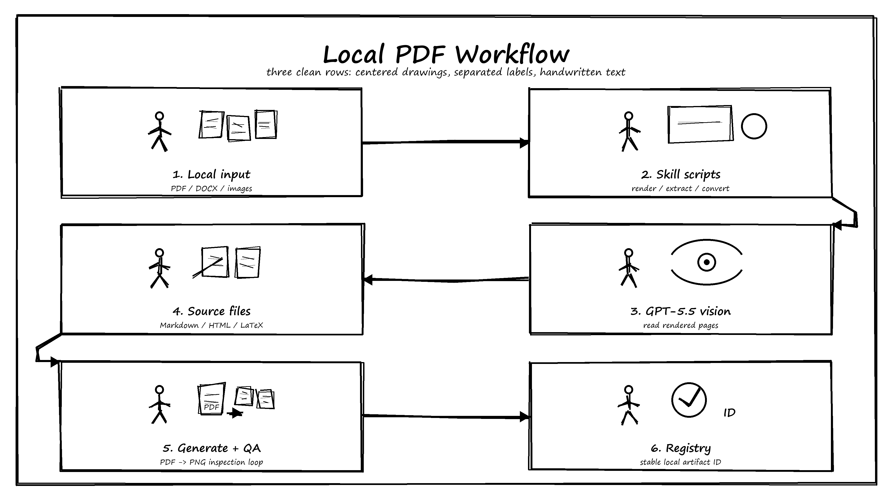
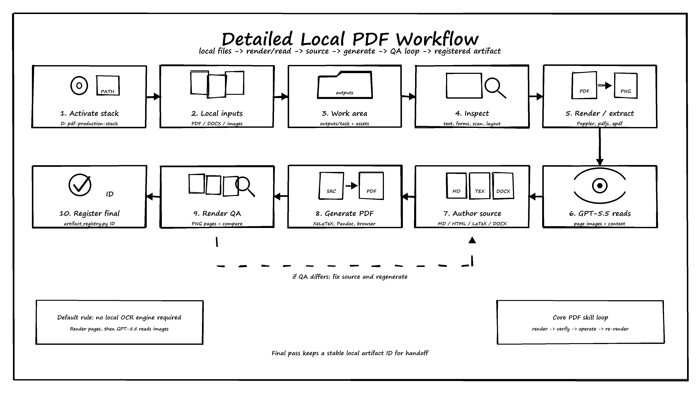

# GPT-5.5 PDF/DOCX Local Workbench

[简体中文](./README.zh-CN.md)

Independent, unofficial, source-available mixed-source workbench for local PDF/DOCX document workflows. It provides practical docs, scripts, and helper CLIs for rendering, inspecting, converting, generating, QA-checking, and registering document artifacts on a local machine.



## Project Status

- **Public posture:** source-available mixed-source workbench, not a conventional all-content open-source release.
- **Affiliation:** not affiliated with, endorsed by, or distributed by OpenAI, Anthropic, or any other platform provider named in the docs.
- **License boundary:** MIT-style permission is intended only for original repository-authored documentation, diagrams, local workflow notes, and glue material.

Read [`LICENSE`](./LICENSE) and [`NOTICE`](./NOTICE) before redistributing, mirroring, or reusing anything beyond local evaluation.

## What This Is

- A local PDF/DOCX workbench organized around direct local file access.
- A collection of PDF scripts, DOCX scripts, task docs, examples, troubleshooting notes, and helper CLIs.
- A non-OCR workflow reference for rendering low-text/scanned pages to images and using GPT-5.5-style multimodal page review.
- A local replacement map for platform concepts such as `/home/oai/skills`, `/mnt/data`, screenshot tools, `file_search`, and artifact registration.

## What This Is Not

- Not an official OpenAI package or an OpenAI internal platform service.
- Not an exact copy of any internal document skill environment and not a parity claim.
- Not a fully cleared open-source distribution of imported, adapted, reference, or third-party materials unless their provenance and license are separately reviewed.
- Not a repository of generated PDFs, private inputs, live registries, `node_modules/`, or machine-local production stacks.

## Features

- PDF rendering, inspection, extraction, editing, redaction, conversion, preflight, form, and artifact-registration helpers under `skills/pdfs/`.
- JavaScript PDF helpers based on `pdf-lib` and `pdfjs-dist` under `skills/pdfs/js/`.
- DOCX task docs and helper scripts under `skills/docx/`.
- Quick-start and production workflow docs for local PDF generation and QA rendering.
- Example artifact registry row at `outputs/artifacts/registry.example.jsonl` without committing generated outputs.
- Excalidraw/SVG/PNG workflow illustration assets under `assets/`.

## Quick Start

Start with [`QUICKSTART.md`](./QUICKSTART.md) for the clone-to-first-check path.

The short path is:

1. Activate your local PDF stack, or follow [`skills/pdfs/docs/local-opencode-gpt55-install.md`](./skills/pdfs/docs/local-opencode-gpt55-install.md) for the minimal Python/JS setup.
2. Verify the Python and JavaScript helper dependencies listed in [`QUICKSTART.md`](./QUICKSTART.md).
3. Create local `data/` and `outputs/` folders for inputs, generated files, QA renders, and registry rows.

## Common Workflows

- PDF reading/review: [`skills/pdfs/SKILL.md`](./skills/pdfs/SKILL.md) and [`skills/pdfs/tasks/read_review.md`](./skills/pdfs/tasks/read_review.md).
- Page rendering for visual QA or multimodal review: [`skills/pdfs/scripts/render_pdf.py`](./skills/pdfs/scripts/render_pdf.py).
- HTML/Markdown/LaTeX to PDF: conversion scripts under [`skills/pdfs/scripts/`](./skills/pdfs/scripts/).
- Artifact registration: [`skills/pdfs/scripts/artifact_registry.py`](./skills/pdfs/scripts/artifact_registry.py) and [`outputs/artifacts/registry.example.jsonl`](./outputs/artifacts/registry.example.jsonl).
- DOCX work: [`skills/docx/SKILL.md`](./skills/docx/SKILL.md).
- Complete non-OCR production loop: [`PDF_PRODUCTION_WORKFLOW.md`](./PDF_PRODUCTION_WORKFLOW.md).



## Documentation Map

- [`QUICKSTART.md`](./QUICKSTART.md): shortest local verification path after cloning.
- [`PDF_PRODUCTION_WORKFLOW.md`](./PDF_PRODUCTION_WORKFLOW.md): full local non-OCR PDF production workflow.
- [`skills/pdfs/docs/platform-local-replacements.md`](./skills/pdfs/docs/platform-local-replacements.md): local replacements for platform-only concepts.
- [`skills/pdfs/docs/local-opencode-gpt55-install.md`](./skills/pdfs/docs/local-opencode-gpt55-install.md): local OpenCode/GPT-5.5 setup notes.

## Repository Layout

```text
assets/                         workflow illustrations and sources
skills/pdfs/                    adapted local PDF workbench
skills/docx/                    imported local DOCX workbench
outputs/artifacts/registry.example.jsonl committed artifact registry example
QUICKSTART.md                   clone-to-first-check guide
PDF_PRODUCTION_WORKFLOW.md      complete local PDF production guide
```

The full PDF and DOCX package inventories live in their respective `SKILL.md`, `tasks/`, `docs/`, `scripts/`, `examples/`, and `troubleshooting/` folders instead of being duplicated in this landing page.

## Runtime State

The default local workflow reads files from your computer or project path, processes PDFs/DOCX with packaged scripts, writes generated deliverables under `outputs/`, and registers important outputs with `artifact_registry.py`.

These runtime paths are intentionally local and should not be committed:

```text
data/
outputs/artifacts/registry.jsonl
outputs/generated-pdf/
outputs/full-stack-smoke/
outputs/prod-ocr-workflow/
```

`outputs/artifacts/registry.example.jsonl` is the only committed output-like file. Detailed platform path mappings live in [`skills/pdfs/docs/platform-local-replacements.md`](./skills/pdfs/docs/platform-local-replacements.md).

## License And Notices

This repository is source-available and mixed-source. See [`LICENSE`](./LICENSE) for the license boundary and [`NOTICE`](./NOTICE) for provenance, trademark, and redistribution notes.

Do not treat any imported, adapted, reference, or third-party material as relicensed or redistribution-cleared by this repository without separate provenance review.

## Limitations

- Local production commands may depend on machine-local tools such as MiKTeX, Pandoc, Poppler, Ghostscript, LibreOffice, qpdf, Playwright, Python packages, and Node packages.
- The default workflow avoids requiring a local OCR engine; scanned or low-text PDFs are intended to be rendered to images and reviewed with GPT-5.5-style multimodal reading.
- Final PDFs should be rendered back to images for QA before being treated as complete.
